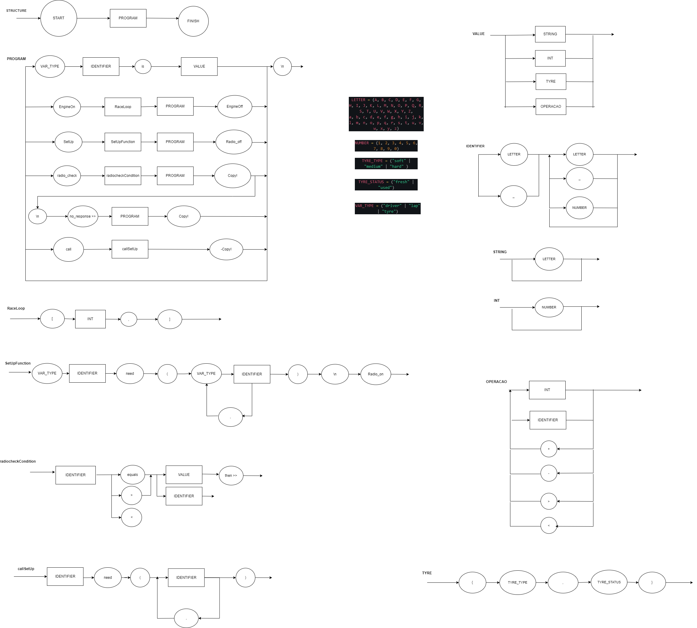

# Linguagem de Fórmula 1 


## Feito por :raising_hand_woman:

- Lívia Sayuri Makuta.

## Primeiro objetivo :round_pushpin: :

- 27/Mar/2023: Linguagem estruturada segundo a EBNF - Tarefa #1 da lista.  :heavy_check_mark:

A primeira tarefa do projeto é desenvolver ideias para a linguagem que ainda vai ser lapidada a partir da EBNF.

Nesse sentido pensei em desenvolver uma linguagem de fórmula1 que busca montar a estratégia de corrida de um piloto ou time de fórmula1.
Além disso, para ficar mais divertido, o objetivo final do programa é retornar uma possível conversa de rádio a partir da estratégia montada pelo usuário programador. 

Sendo assim existem algumas limitações impostas principalmente por conta do contexto, por exemplo, uma lista não pode ser montada - já que esse tipo de variável nem existe. Todavia, existem variáveis definidas propriamente para o contexto, como tyre e sets_of_tyres.

## EBNF da linguagem

``` lua
LETTER = (A, B, C, D, E, F, G, H, I, J, K, L, M, N, O, P, Q, R, S, T, U, V, W, X, Y, Z, 
a, b, c, d, e, f, g, h, i, j, k, l, m, n, o, p, q, r, s, t, u, v, w, x, y, z)

NUMBER = (1, 2, 3, 4, 5, 6, 7, 8, 9, 0)

SECTOR = ("sector1" | "sector2" | "sector3")

TYRE_TYPE = ("soft" | "medium" | "hard" | "intermediate" | "wet")

TYRE_STATUS = ("fresh" | "lil_used" | "too_used")

VAR_TYPE = ("driver" | "driver_engineer" | "team" | "grand_prix" | "expected_sc" | "rain_probability" | "drs_usage" | 
"aggressive_overtaking" | "conservative_overtaking" | "sets_of_tyres" | "lap" | "tyre")

ATRIBUTE = ("type" | "status" | "availability" | "sector"| "start_lap"| "end_lap" )


VALUE = STRING | INT | FLOAT | BOOLEAN | TUPLE_INT | TUPLE_DRS | TYRE | TYRE_SET | OPERACAO

STRING = {LETTER}

INT = {NUMBER}+

FLOAT = INT, ".", INT

BOOLEAN = ("True" | "False")

TUPLE_INT = "(", INT, ",", INT, ")"

TUPLE_DRS = "(", SECTOR, {",",SECTOR}, ",", INT, ")"

TYRE = "{", TYRE_TYPE, ",", TYRE_STATUS, "}"

TYRE_SET = "{", TYRE, {",", TYRE}, "}"

IDENTIFIER = (LETTER| "_") , {LETTER | "_" | NUMBER}

REF_VAR_ATRIBUTE = ATRIBUTE, "of.", IDENTIFIER

OPERACAO = (INT | IDENTIFIER), {("+" | "-" | "<" | ">" | ">=" | "<="), (INT | IDENTIFIER)}

STRUCTURE = "ITS LIGHTS OUT AND AWAY WE GO", PROGRAM , "CHECKERED FLAG"
 


PROGRAM = {VAR_TYPE, IDENTIFIER, "is",  VALUE, "\n" | "EngineOn", RaceLoop, PROGRAM, "EngineOff", "\n"| "SetUp", SetUpFunction, PROGRAM, "Radio_off", "\n"| "radio_check", radiocheckCondition, PROGRAM, "-Copy!", "\n" ,  ["no_response >>", PROGRAM, "-Copy!", "\n"] |
"call", callSetUp, "-Copy!","\n"}

RaceLoop = "[", INT, "]"

SetUpFunction = IDENTIFIER, "need", VAR_TYPE, IDENTIFIER, {",", VAR_TYPE, IDENTIFIER}, "\n", "Radio_on"

radiocheckCondition = (IDENTIFIER | REF_VAR_ATRIBUTE), ("is"| "in") , (VALUE | IDENTIFIER | REF_VAR_ATRIBUTE), {("and" | "or"), (IDENTIFIER | REF_VAR_ATRIBUTE), ("is"| "in") , (VALUE | IDENTIFIER | REF_VAR_ATRIBUTE)}, "then >>"

callSetUp = IDENTIFIER, "need", VAR_TYPE, IDENTIFIER, {",", VAR_TYPE, IDENTIFIER}

```

## Diagrama Sintático da linguagem




## Exemplo do uso da linguagem

```lua

ITS LIGHTS OUT AND AWAY WE GO

driver piloto1 is Leclerc
driver_engineer engenheiro_piloto1 is Martin Whitmarsh
team time_piloto1 is Ferrari
grand_prix corrida is Bahrain
expected_sc SC is False
rain_probability chance_chuva is 0.2
drs_usage uso_drs is (sector1, 3)
aggressive_overtaking agressivo is (31,50)
conservative_overtaking conservador is (1,28)
sets_of_tyres conjunto is {{soft, fresh}, {medium, fresh}, {hard, fresh}, {medium, used}}
lap voltas is 0
tyres pneu_atual is {soft, fresh}


SetUp Pitstop need tyres pneu, driver piloto
Radio_on
radio_check typeof.pneu is soft then >> typeof.pneu is medium and statusof.pneu is used -Copy!
radio_check typeof.pneu is medium and statusof.pneu is used then >> typeof.pneu is hard and statusof.pneu is fresh -Copy!
radio_check typeof.pneu is hard then >> typeof.pneu is medium and statusof.pneu is fresh -Copy!
Radio_off


SetUp expectedRain need rain_probability chance_of_rain, conservative_overtaking coservador
Radio_on
radio_check chance_of_rain is 0.2 then >> conservador is (1,20) -Copy!
no_responde >> conservador is (1,30) -Copy!
Radio_off

SetUp use_DRS need drs_usage uso_drs, lap voltas, aggressive_overtaking agressivo
Radio_on
radio_check uso_drs > 0 and voltas in agressivo then >> availabilityof.uso_drs is availabilityof.uso_drs-1
Radio_off

EngineOn[voltas]
radio_check voltas is 10 then >> call Pitstop need tyres pneu_atual, driver piloto1 -Copy!
radio_check voltas is 16 then >> call use_DRS need drs_usage uso_drs, lap voltas, aggressive_overtaking agressivo -Copy!
radio_check voltas is 21 then >> call Pitstop need tyres pneu_atual, driver piloto1 -Copy!
radio_check voltas is 41 then >> call Pitstop need tyres pneu_atual, driver piloto1 -Copy!
radio_check voltas is 42 then >> call use_DRS need drs_usage uso_drs, lap voltas, aggressive_overtaking agressivo -Copy!
radio_check voltas is 45 then >> call use_DRS need drs_usage uso_drs, lap voltas, aggressive_overtaking agressivo -Copy!
EngineOff


CHECKERED FLAG

```

## Flex : análise léxica

Para analisar os tokens que fazem parte do código, foi feito um programa em flex que identifica se o token pertence a linguagem ou não. Esse programa está em `f1.l`. Para compilá-lo e executá-lo basta:

``` bash
flex f1.l
gcc lex.yy.c -o seu_programa -lfl
./seu_programa < teste.txt 
```

## Bison : análise sintática

```bash
bison -d f1.y
gcc -o parser f1.tab.c main.c
./parser < entrada.txt
```

## Linkando tudo

 cc -o f1.tab.c lex.yy.c -lfl -DYYDEBUG
cc -o f1 f1.tab.c lex.yy.c -lfl -DYYDEBUG


